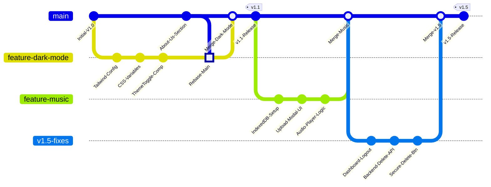

# CircleUp: DevOps & Workflow Presentation

## 1. Introduction
*   **Project**: CircleUp
*   **Concept**: A real-time community engagement platform featuring chat, events, and status updates.
*   **Tech Stack**: MERN (MongoDB, Express, React, Node.js) + Socket.IO.

---

## 2. Problem Identification: "The Group Chat Chaos"
In today's digital landscape, we face a common frustration:

*   **🚫 No Event Planning in WhatsApp**:
    *   *Scenario*: You try to plan a trip or a meetup in a WhatsApp group.
    *   *Result*: Details get buried under hundreds of messages ("Good morning" spam), leading to confusion about *who* is coming and *where* to meet.
*   **📉 Boring Status Updates**: Standard text/image statuses lack the "vibe." You can't add your favorite song to express your mood without using third-party editing tools.
*   **🔒 Privacy & Data Concerns**: Popular apps upload *everything* to their servers. Why send your local music or personal voice notes to the cloud if they only need to be heard by friends nearby?

## 3. The Solution: CircleUp
CircleUp bridges these gaps by offering a unified platform:
*   **All-in-One**: Combines real-time chat with structured community event management.
*   **Enhanced Expression**: "Status Music" allows users to express their mood safely using local storage, avoiding server bloat.
*   **User-Centric**: Built with a focus on aesthetics and usability (Dark Mode, responsive design).
*   **Secure**: Robust authentication and ownership verification for content management.

---

## 4. Technical Architecture (Brief)

### 🖥️ Frontend
*   **Core**: React.js with Vite for fast HMR (Hot Module Replacement).
*   **Styling**: TailwindCSS & DaisyUI for rapid, component-based design (enabled easy Dark Mode implementation).
*   **State Management**: Zustand for global state.
*   **Communications**: Socket.IO Client for real-time bidirectional events.

### ⚙️ Backend
*   **Server**: Node.js & Express.
*   **Database**: MongoDB (NoSQL) for flexible schema storage (Users, Groups, Events).
*   **Real-time**: Socket.IO server handling instant messaging and status updates.
*   **Security**: JWT for stateless authentication.

---

## 5. Version Control Strategy (Git)
We adopted a robust **Feature Branch Workflow** to ensure code stability and enable parallel development.

### 🌿 Branching Structure
Instead of committing directly to `main`, we isolated every major feature into its own branch:

1.  **`main`**: The stable production-ready branch.
2.  **`dark-mode`**: Dedicated branch for implementing system-wide theming.
3.  **`status-music`**: Experimental branch for the local audio status feature.
4.  **`v1.5`**: Release branch for a collection of bug-fixes and minor enhancements.

### 🔄 DevOps Highlight: Git Rebase vs. Merge
We utilized advanced Git tools to maintain a clean history.

*   **Scenario**: While working on `dark-mode`, changes were made to the `main` branch (e.g., "About Us" section).
*   **Action**: Used `git rebase main` while on the feature branch.
*   **Result**: This moved the `dark-mode` commits *on top* of the new `main` commits, creating a linear history without unnecessary "merge bubbles."

### 🚀 Integration Workflow
1.  **Develop**: Code written in `feature-branch`.
2.  **Verify**: Local build and testing (`npm run build`).
3.  **Merge**:
    *   `git checkout main`
    *   `git merge <feature-branch>`
    *   Used Fast-Forward merges where possible to keep history straight.

### 📊 Git Workflow Diagram

---

## 6. Key Feature Delivery
The workflow supported the rapid deployment of:

### 🌑 Dark Mode (v1.1)
*   **DevOps Hook**: Required modifying global Tailwind config and CSS variables without breaking existing layouts.
*   **Result**: Seamless toggle functionality persisted via LocalStorage.

### 🎵 Status Music
*   **DevOps Hook**: Handling binary data (audio) efficiently.
*   **Decision**: Implemented client-side IndexedDB caching instead of server uploads to reduce bandwidth costs and server load—a "Green DevOps" choice.

### 🛠️ v1.5 Release (Bug Fixes)
*   Agile response to user needs:
    *   **Logout Button**: Added to Dashboard for better UX.
    *   **Secure Deletion**: Implemented backend-validated ownership checks for event deletion.

---

## 7. GitHub Usage
*   **Remote Repositories**: Hosted on GitHub for collaboration.
*   **Release Management**: Tagging versions (`v1.5`) to mark stable deployment points.
*   **Documentation**: maintained a comprehensive `README.md` with badges and clear installation steps.

---

## 8. Conclusion
This project demonstrates not just full-stack development skills, but a disciplined **DevOps mindset**—using Git not just as a save button, but as a tool for managing complexity and ensuring robust software delivery.
